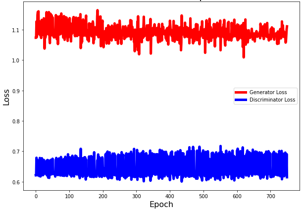
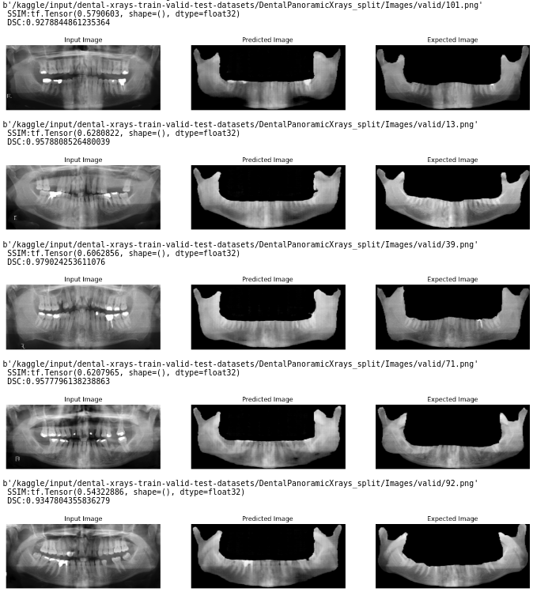

# mandiblesegmentation
CycleGAN model for segmenting Mandibles from Panoramic Dental X-rays

|          Hyperparameter                                           |        Value         |
|-------------------------------------------------------------------|----------------------|
| Number of epochs                                                  |          750         |
| Optimizer                                                         |         Adam         | 
| Activation function used in final layer of Generator function     |         tanh         |              

**Best training SSIM metric achieved is 0.6715**

**Best training DSC  metric achieved is 0.9846**

<b>Plot of Generator Loss vs Discriminator Loss</b>

<b>Test results</b>

